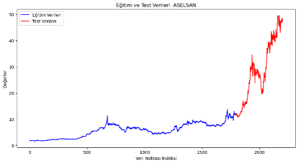
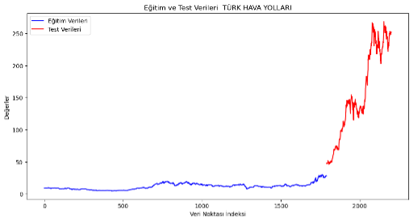
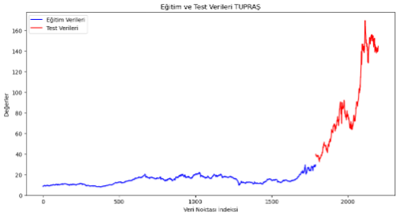
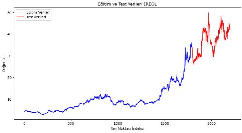
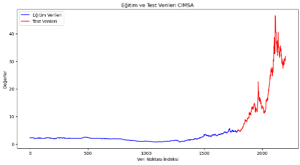
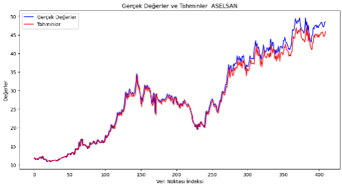
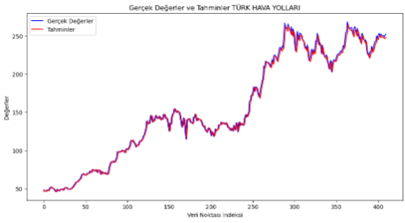
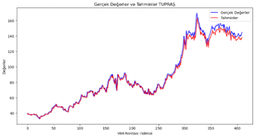
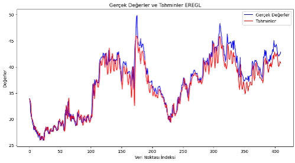
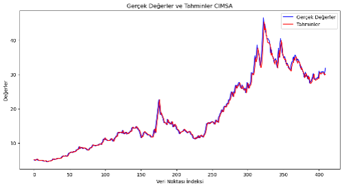

# Stock Price Prediction (LSTM) - ASELSAN, THY, TUPRS, EREGL, CIMSA

This project aims to predict the stock prices of ASELSAN, Turkish Airlines, Pegasus, Ereğli Demir ve Çelik, and Çimsa listed on BIST100 using the LSTM (Long Short-Term Memory) model.

## 📄 Project Summary

In this project, future stock prices were predicted using daily closing prices from February 2, 2015, to the present. Separate models were created for each stock, with 80% of the data used for training and 20% for testing.

## 🛠️ Tools and Libraries Used

- **Python**
- **Pandas**: Data processing and analysis
- **NumPy**: Numerical computations
- **Matplotlib and Seaborn**: Data visualization
- **Scikit-Learn**: Data preprocessing and evaluation metrics
- **TensorFlow/Keras**: LSTM model creation
- **Yahoo Finance API**: Fetching stock data

## ⚙️ Methodology

- **Data Collection**: The stock data for ASELSAN, THY, Pegasus, Ereğli Demir ve Çelik, and Çimsa was obtained using the Yahoo Finance API.
- **Data Preprocessing**: The data was normalized to a 0-1 range using MinMaxScaler and split into training and test sets.
- **Model Creation**: A 3-layer LSTM model was created. The first two layers consist of 100 neurons each, while the final layer is a Dense(1) layer producing a single output. The model was compiled using the "adam" optimizer and "mean squared error" loss function.
- **Model Training**: The model was trained for 100 epochs with 16 data points per batch. 
- **Evaluation**: The model was evaluated using metrics such as R-Squared (R2), Root Mean Squared Error (RMSE), Mean Absolute Percentage Error (MAPE), and Mean Absolute Error (MAE).

## 🖼️ Visualizations

Below are the graphs showing the model's performance on the training and test datasets for each stock:

- **ASELSAN**
  

- **Turkish Airlines**
  

- **Pegasus**
  

- **Ereğli Demir ve Çelik**
  

- **Çimsa**
  

## 🔍 Findings

After training the LSTM model, the following results were obtained on the test data:

| Stock      | RMSE | MAE  | R2   | MAPE  |
|------------|------|------|------|-------|
| ASELS      | 1.52 | 1.08 | 0.98 | 3.37% |
| THYAO      | 5.14 | 3.61 | 0.99 | 2.34% |
| TUPRS      | 4.00 | 2.74 | 0.99 | 2.82% |
| EREGL      | 1.65 | 1.22 | 0.91 | 3.16% |
| CIMSA      | 0.90 | 0.56 | 0.99 | 2.79% |

These results show that the model is successful in predicting stock prices.

## 📊 Predictions and Visualizations

In this section, I present the visualizations of the predictions compared to the actual values for the selected stocks. The figures below illustrate the performance of the model on the test data:

- **ASELSAN**
  

- **Turkish Airlines**
  

- **Pegasus**
  

- **Ereğli Demir ve Çelik**
  

- **Çimsa**
  

Each figure shows the training data (in blue) and the test data (in red). The predictions made by the model closely follow the actual values, demonstrating the accuracy and robustness of the model.

